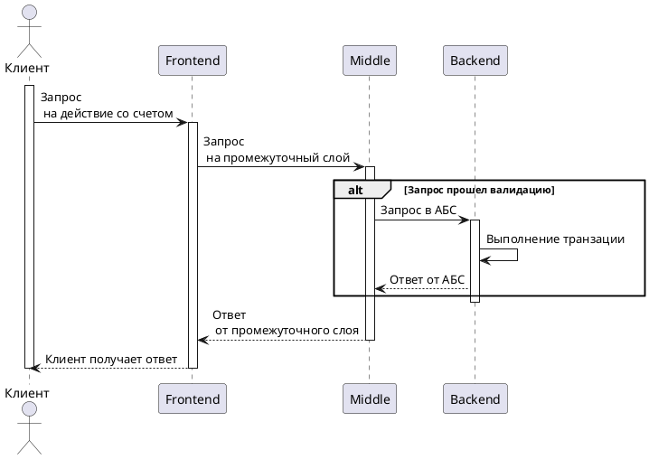

# Ganeev-telegram-bot
## Введение
Приложение представляет собой "Мини-банк", состоящий из трех компонентов:
- Frontend(telegram-bot на Java)
- Middle-слой (Java-сервис)
- Backend (Java-сервис)

Разделы 

&nbsp;&bull;&nbsp;
<a href="##tools">Tools</a> &nbsp;&bull;&nbsp;
<a href="#description-">Description</a> &nbsp;&bull;&nbsp;
<a href="#how-it-works">How it works</a> &nbsp;&bull;&nbsp;
<a href="#quick-start">Quick start</a> &nbsp;&bull;&nbsp;

## Tools
- Java
- Gradle
- Spring
- Posgresql

## Description 
### Frontend 
Принимает запросы пользователей через телеграм и отправляет их в промежуточный слой
### Middle-слой
Представляет собой промежуточный слой, который принимает запросы от telegram-бота, выполняет валидацию и маршрутизирует запросы в "Банк"
### Backend
Система, которая выступает в качестве автоматизированной банковской системы, выполняющей транзакции и хранящей клиентские данные

## How it works

## Quick start
Will be here soon...

